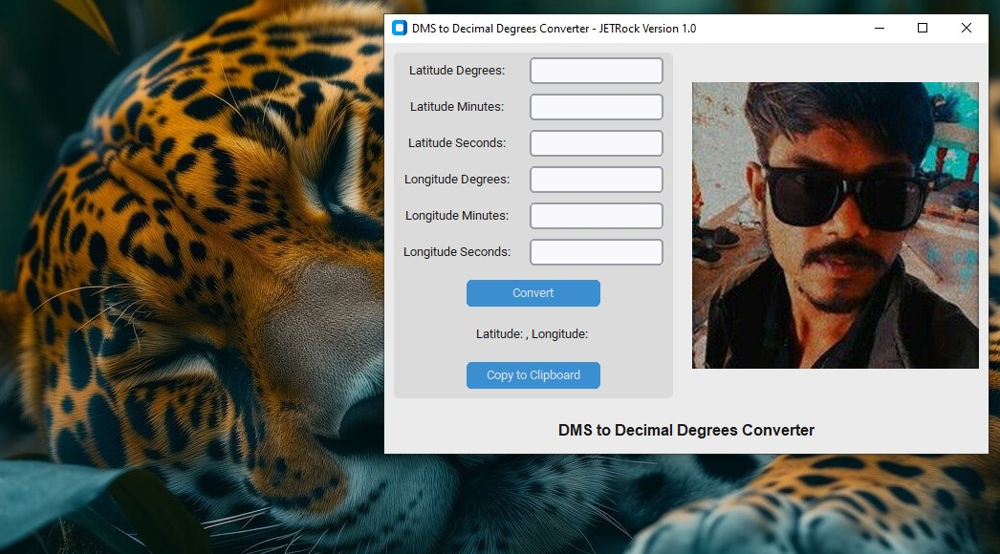

# DMS to Decimal Degrees Converter

## Overview
Hey there! I'm a 25-year-old coder with a knack for cool projects, working in a forest office. Check out my latest creation: a nifty app that converts DMS coordinates to Decimal Degrees. It's easy to use, and if you need a laugh or a cool feature, I've got you covered! Click the image in the app to visit my GitHub profile and explore more of my work.

## Features
- Convert Latitude and Longitude from DMS (Degrees, Minutes, Seconds) to Decimal Degrees.
- Copy the converted coordinates to the clipboard.

## Installation
To run this project, you'll need to have Python installed. You can install the necessary dependencies using the `requirements.txt` file.


1. Clone this repository:
   ```bash
   git clone https://github.com/jeturgavli/dms-to-decimal-degrees-converter.git
   cd dms-to-decimal-degrees-converter
2. Install the required packages:
    ```bash
    pip install -r requirements.txt
    ```
## Screenshots

## Contributing
- Feel free to fork this repository and contribute. Pull requests are welcome!

